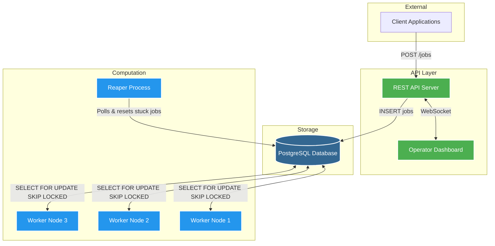

# QueueForge

[](https://github.com/yash9025/QueueForge/actions)
[](https://www.typescriptlang.org/)
[](https://www.postgresql.org/)
[](https://www.docker.com/)

[](https://git.io/typing-svg)

QueueForge is a robust, distributed job processing queue architected from first principles. Utilizing PostgreSQL as the primary source of truth, it provides durable job storage and reliable distribution to a pool of independent worker processes. The system guarantees exact retry mechanisms, graceful failure recovery, and strict exactly-once processing semantics without relying on external message brokers.

## Problem Statement

Modern distributed applications frequently require asynchronous execution of compute-intensive or latency-sensitive tasks (e.g., sending emails, report generation, video transcoding). Synchronous execution within the request/response cycle introduces fragility and latency. QueueForge addresses this by decoupling task submission from execution, durably persisting work items, and orchestrating a fleet of scalable workers to process them efficiently.

## System Design Architecture

The architecture eliminates the need for standalone message brokers by leveraging advanced PostgreSQL features for coordination.



## Key Design Decisions

### PostgreSQL for Concurrency Control
Rather than introducing additional infrastructure overhead with tools like Redis or RabbitMQ, QueueForge utilizes PostgreSQL's `SELECT ... FOR UPDATE SKIP LOCKED`. This provides atomic, race-condition-free job claiming. The database ensures strong ACID guarantees for job durability while maintaining a streamlined technology stack.

### Lock-Free Horizontal Scaling
Workers utilize the `SKIP LOCKED` directive during the polling phase. If a worker process locks a specific record, subsequent worker queries immediately bypass the locked row and claim the next available job. This completely eliminates database contention and allows the worker pool to scale horizontally without blocking.

### Fault Tolerance and Dead Letter Queue (DLQ)
Jobs that encounter runtime exceptions are gracefully caught. The system increments an attempt counter and requeues the job utilizing an **exponential backoff** strategy. To prevent infinite processing loops (poison-pill jobs), any task exceeding the configured `max_attempts` threshold is automatically routed to a Dead Letter Queue (`status = 'dead_letter'`) for manual inspection.

### Autonomous Reaper Process
In distributed systems, worker nodes may experience catastrophic failures (e.g., OOM kills, hardware faults) while actively processing a job. Such jobs remain locked in a `running` state. QueueForge employs an independent **Reaper** process that continuously monitors worker health via heartbeats. If a worker fails to emit a heartbeat within the acceptable threshold, the Reaper forcibly reclaims the stalled jobs and resets them to a `pending` state for reassignment.

## Setup & Running Locally

QueueForge is fully containerized, ensuring a consistent environment across development and production.

```bash
# Clone the repository
git clone https://github.com/yash9025/QueueForge.git
cd QueueForge

# Provision the entire stack (API, Workers, Reaper, Postgres, Dashboard, Seeder)
docker compose up --build
```

### Services Exposed

- **API Server:** `http://localhost:3000`
- **Dashboard:** `http://localhost:5173`
  - *Default Credentials:* `admin` / `secret123`